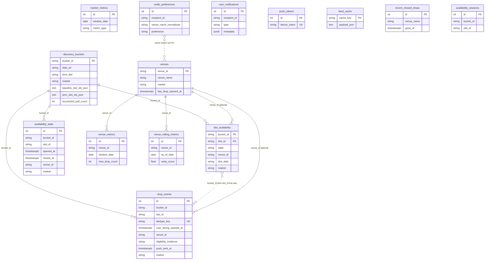
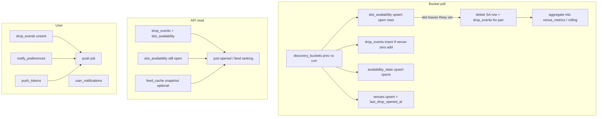

# Database architecture (graph view)

Snag / DropFeed **Postgres** layout: discovery and feed are **string-keyed** (`bucket_id`, `slot_id`, `venue_id`) more than formal `FOREIGN KEY` constraints. Edges below are **logical** relationships the code enforces.

---

## 1. Domain map (mental model)

| Domain | Tables | Role |
|--------|--------|------|
| **Discovery window** | `discovery_buckets` | One row per poll bucket `(market, date, time_slot)`; stores `prev` / baseline slot id JSON for diffs. |
| **Live projection** | `slot_availability` | Current Resy snapshot per `(bucket_id, slot_id)` — what the feed treats as open/closed. |
| **Drop facts** | `drop_events` | “Venue had zero slots → now has a slot” emits a row; tied to `(bucket_id, slot_id)`; pruned when slot closes or by retention. |
| **Session / metrics input** | `availability_state` | One row per open slot (upsert); closed rows aggregated then removed. Legacy: `availability_sessions`. |
| **Venues** | `venues` | Canonical venue profile + `last_drop_opened_at` (denormalized for follows without scanning `drop_events`). |
| **Aggregates** | `venue_metrics`, `market_metrics`, `venue_rolling_metrics` | Daily / rolling stats for ranking and enrichment (not user analytics dashboards). |
| **User / notify** | `notify_preferences`, `user_notifications`, `push_tokens` | Watch list, in-app activity, APNs device rows. |
| **Cache** | `feed_cache` | Precomputed JSON for fast `GET` feed paths. |
| **UX aux** | `recent_missed_drops` | “Just missed” style recent closes. |

---

## 2. ER diagram (tables & keys)

---

## 3. Hot path: poll → projection → drop → feed

How a **bucket poll** touches tables (simplified):

---

## 4. Cardinality cheatsheet

- **`discovery_buckets`**: ~28 active rows per market (14 days × 2 time slots); grows then prunes with window.
- **`slot_availability`**: on the order of **open Resy slots** across buckets (large but bounded by window + caps).
- **`drop_events`**: intended **≤ one row per open `(bucket_id, slot_id)`** (plus retention); duplicates pruned by jobs.
- **`venues`**: one row per Resy `venue_id` seen; `last_drop_opened_at` updated on each emit.
- **`notify_preferences`**: rows per `recipient_id` × saved/excluded venue name (normalized).

---

## 5. Where to look in code

- Models: `backend/app/models/*.py`
- Poll + prune + compaction: `backend/app/services/discovery/buckets.py`
- Retention / scale notes: `backend/docs/SCALABILITY_AND_MAINTENANCE.md`

**Viewing diagrams:** GitHub renders Mermaid in this file. In VS Code / Cursor, use a Mermaid preview extension, or paste the fenced blocks into [mermaid.live](https://mermaid.live).
