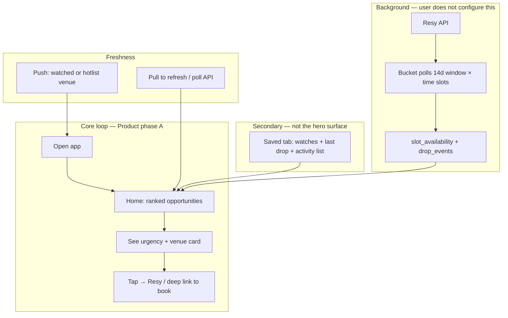
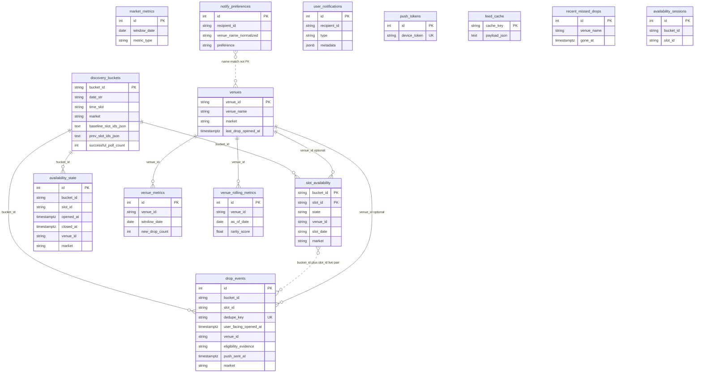
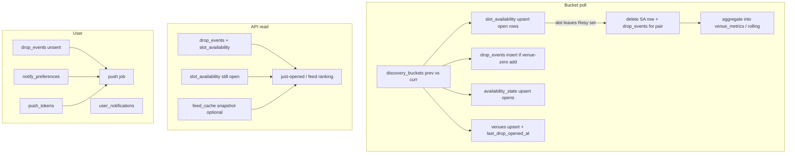

# Database architecture (graph view)

Snag / DropFeed **Postgres** layout: discovery and feed are **string-keyed** (`bucket_id`, `slot_id`, `venue_id`) more than formal `FOREIGN KEY` constraints. Edges below are **logical** relationships the code enforces.

---

## 1. User experience — flowchart

What the product is trying to feel like: **you open the app and react** — no search-first workflow. The system continuously compares “what Resy had last time” vs “now,” promotes **transitions** (especially “this venue had nothing, now it has a slot”), ranks them, and surfaces **freshness** (“opened X ago”).

### What each step feels like

| Step | User perception | Backend / data (roughly) |
|------|------------------|---------------------------|
| **Background** | Tables “appear from nowhere” without you searching | Scheduled jobs fill `discovery_buckets` diffs → `slot_availability`; rare transitions create `drop_events` and bump `venues.last_drop_opened_at`. |
| **Home** | A **short, ordered** list — best opportunities first, next ~14 days | APIs read open slots + drop metadata + ranking inputs (`venue_rolling_metrics`, eligibility). May use `feed_cache` snapshot. |
| **See** | **“Opened 12s ago”**, one clear primary action | `user_facing_opened_at`, copy from server; not a filter UI on v1. |
| **Act** | **One tap toward booking** | Client opens Resy URL; no in-app checkout in this architecture. |
| **Push** | “Something you care about just opened” | `push_tokens`, `notify_preferences`, `drop_events` with `push_sent_at`; only venues on effective watch list. |
| **Saved** | “Who I’m watching” + lightweight **activity** | `notify_preferences`, `GET .../follows/status` (venues + last drop), `user_notifications` timeline. |

---

## 2. Scalability pressure points and cavities

**Pressure points** are where load or data volume bites first. **Cavities** are intentional limits, missing layers, or product/tech gaps you should know about.

### Tied to the UX flow

| Area | Scalability risk | Cavity / gap |
|------|------------------|--------------|
| **Home / feed read** | Large `slot_availability` + `drop_events` scans; loading many `payload_json` rows into memory for just-opened / still-open paths | Caps exist but some code paths historically had **no or high limits** — see `SCALABILITY_AND_MAINTENANCE.md` §1. Stale `feed_cache` if snapshot rebuild lags → user sees slightly old ordering. |
| **Background polling** | **Resy rate limits** and wall-clock: more markets × more buckets = more HTTP. Thread pool and cooldown help but **provider is single-vendor** today. | No second provider in the hot path; outage or throttle affects everyone. |
| **Postgres writes** | Bursty upserts per bucket per tick; prunes/compaction are **batched** but daily job can still run heavy DELETEs | Needs **VACUUM** / monitoring after big retention jobs; partition-by-date is future-only. |
| **Push** | Linear scan of recent `drop_events` × filter by watch list; capped per run | **Single default `recipient_id`** in places — not multi-user auth-ready; token table grows with devices (bounded by real installs). |
| **Saved / follows** | Small per-user surface | Watch matching is **name-normalized**, not a hard FK to `venues.venue_id` — renames / ambiguity edge cases. |
| **Identity** | Low DB cost | **`X-Recipient-Id` / default** — no full account model; multi-device merge and privacy are future work. |

### Product / architecture cavities (by design or not yet built)

- **No in-app booking** — handoff to Resy; Snag does not hold inventory.
- **No global search on the home path** — by principle (Product A); scale of search index is avoided on purpose.
- **Eligibility / “fully booked before”** depends on **scan coverage and history** — weak or partial polls create **false positives or misses** (correctness risk, not just scale).
- **“Still open” truth** is **eventually consistent** with Resy; user can tap and find slot gone — product should keep copy honest (“often goes fast”).
- **Multi-market** exists in schema but **ops complexity** (keys, hotspots, notify lists) grows with each market.

For file/line-level notes and suggested mitigations, keep **`backend/docs/SCALABILITY_AND_MAINTENANCE.md`** as the detailed list.

---

## 3. Domain map (mental model)

| Domain | Tables | Role |
|--------|--------|------|
| **Discovery window** | `discovery_buckets` | One row per poll bucket `(market, date, time_slot)`; stores `prev` / baseline slot id JSON for diffs. |
| **Live projection** | `slot_availability` | Current Resy snapshot per `(bucket_id, slot_id)` — what the feed treats as open/closed. |
| **Drop facts** | `drop_events` | “Venue had zero slots → now has a slot” emits a row; tied to `(bucket_id, slot_id)`; pruned when slot closes or by retention. |
| **Session / metrics input** | `availability_state` | One row per open slot (upsert); closed rows aggregated then removed. Legacy: `availability_sessions`. |
| **Venues** | `venues` | Canonical venue profile + `last_drop_opened_at` (denormalized for follows without scanning `drop_events`). |
| **Aggregates** | `venue_metrics`, `market_metrics`, `venue_rolling_metrics` | Daily / rolling stats for ranking and enrichment (not user analytics dashboards). |
| **User / notify** | `notify_preferences`, `user_notifications`, `push_tokens` | Watch list, in-app activity, APNs device rows. |
| **Cache** | `feed_cache` | Precomputed JSON for fast `GET` feed paths. |
| **UX aux** | `recent_missed_drops` | “Just missed” style recent closes. |

---

## 4. ER diagram (tables & keys)

---

## 5. Hot path: poll → projection → drop → feed

How a **bucket poll** touches tables (simplified):

---

## 6. Cardinality cheatsheet

- **`discovery_buckets`**: ~28 active rows per market (14 days × 2 time slots); grows then prunes with window.
- **`slot_availability`**: on the order of **open Resy slots** across buckets (large but bounded by window + caps).
- **`drop_events`**: intended **≤ one row per open `(bucket_id, slot_id)`** (plus retention); duplicates pruned by jobs.
- **`venues`**: one row per Resy `venue_id` seen; `last_drop_opened_at` updated on each emit.
- **`notify_preferences`**: rows per `recipient_id` × saved/excluded venue name (normalized).

---

## 7. Where to look in code

- Models: `backend/app/models/*.py`
- Poll + prune + compaction: `backend/app/services/discovery/buckets.py`
- Retention / scale notes: `backend/docs/SCALABILITY_AND_MAINTENANCE.md`

**Viewing diagrams:** GitHub renders Mermaid in this file. In VS Code / Cursor, use a Mermaid preview extension, or paste the fenced blocks into [mermaid.live](https://mermaid.live).
