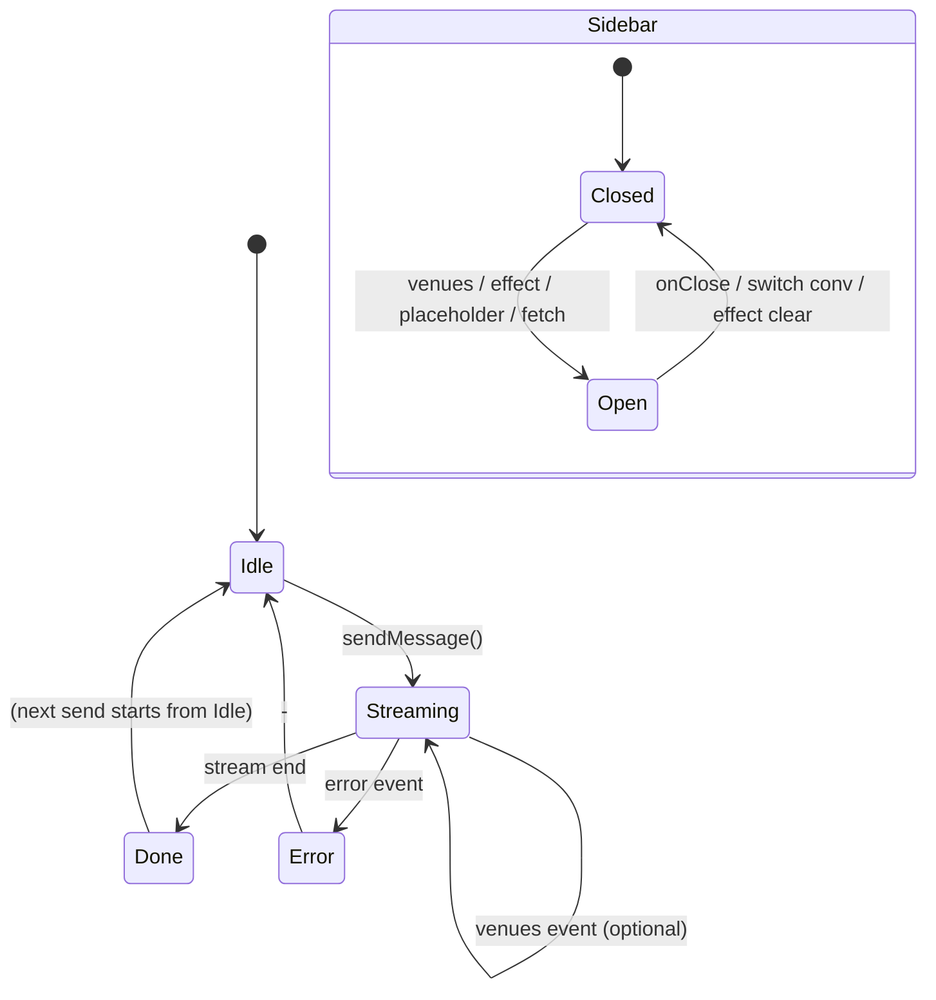

# State machines & flows

This doc describes the main stateful flows in The Concierge (frontend + backend) so we can spot races, missing transitions, and unclear states.

---

## 1. Chat send / stream (frontend)

```
                    sendMessage()
                          │
                          ▼
    ┌─────────┐     ┌─────────────┐     content      ┌─────────────┐
    │  IDLE   │────▶│  STREAMING  │─────────────────▶│  STREAMING  │
    │         │     │ (loading=T) │     events       │ (content+)  │
    └─────────┘     └──────┬──────┘                  └──────┬──────┘
         ▲                 │                                │
         │                 │ data.venues                     │ stream end
         │                 │ (optional)                      │ (set stream: false,
         │                 ▼                                │  merge venueList)
         │          ┌─────────────┐                          │
         │          │  STREAMING  │◀─────────────────────────┘
         │          │ + venues   │
         │          └──────┬──────┘
         │                 │
         │                 │ done event → setMessages(stream: false)
         │                 │             setLoading(false)
         │                 ▼
         │          ┌─────────────┐     fetch /chat/venues
         │          │   DONE      │     (fallback, async)
         │          │ (loading=F) │─────────────────┐
         │          └──────┬──────┘                 │
         │                 │                        ▼
         │                 │                 maybe set venueListItems
         │                 │                 + setRestaurantList
         │                 └────────────────────────┘
         │
         │  error
         └──────────────────────────────────────────  setMessages(+ error msg)
                                                       setLoading(false)
```

**States (conceptual):**

| State      | loading | Last message role | Last message stream | Notes                    |
|-----------|---------|--------------------|----------------------|--------------------------|
| IDLE      | false   | any                | -                    | No request in flight     |
| STREAMING | true    | assistant          | true                 | Content and/or venues    |
| DONE      | false   | assistant          | false                | May have venueListItems  |
| ERROR     | false   | assistant          | false                | content = "Error: ..."   |

**Note:** Stream path uses `lastIdxForSidebar = next.length - 1` from inside the same `setMessages` updater when processing `data.venues`, so `messageIndex` is always the current last (assistant) message. Fallback GET `/chat/venues` only applies when last message has no `venueListItems` and uses `lastIdx` the same way.

---

## 2. Sidebar (restaurantList) state machine

```
    ┌─────────────┐
    │   CLOSED    │   restaurantList === null
    │ (null)      │
    └──────┬──────┘
           │
           │ open (any of):
           │ • venues event during stream → setRestaurantList({ messageIndex, items, placeholderType })
           │ • stream end merge (venueList from ref) → already set by venues event
           │ • useEffect (last message has venueListItems or parsed content ≥ 2)
           │ • placeholder / bubble click → setRestaurantList(prev => …)
           │ • loadMessagesForSession + GET /chat/venues
           │ • GET /chat/venues fallback after stream
           │
           ▼
    ┌─────────────┐
    │    OPEN     │   restaurantList !== null
    │ items[]     │   restaurantList.placeholderType === "venue_list"
    │ (0 or more) │   restaurantList.messageIndex, restaurantList.items
    └──────┬──────┘
           │
           │ close (any of):
           │ • onClose() → setRestaurantList(null)
           │ • messages.length === 0 → setRestaurantList(null)
           │ • switchConversation() / startNewConversation() → setRestaurantList(null)
           │ • useEffect: last message done, no venueListItems, parsed content < 2;
           │   only clear if prev is not for current message (prev.messageIndex !== lastIndex)
           │
           └──────────────────────────────────────────────────────────────────▶ CLOSED
```

**Multiple writers to `restaurantList`:**

| Writer                    | When                    | Can race with                    |
|---------------------------|-------------------------|-----------------------------------|
| processEvent (venues)     | During stream           | Stream end, useEffect            |
| setMessages (stream end)  | After stream loop       | useEffect, venues fallback       |
| useEffect (messages)      | On messages change      | Stream updates, fallback         |
| Placeholder / bubble click| User click              | Any async update                 |
| loadMessagesForSession    | After GET /messages      | GET /chat/venues right after     |
| GET /chat/venues fallback | After stream, async     | User navigated away              |

**Guards:** Stream sets `messageIndex` from `next.length - 1` (no ref). Effect never clears when `prev?.messageIndex === lastIndex`, so we don’t race with stream or fallback for the current message.

---

## 3. Last assistant message (derived state)

Not a single state variable; derived from `messages[messages.length - 1]`:

```
    (no messages or last is user)
              │
              ▼
    ┌─────────────────┐
    │  NONE / USER     │
    └────────┬─────────┘
             │ append assistant (stream: true)
             ▼
    ┌─────────────────┐     content events     ┌─────────────────┐
    │  STREAMING       │───────────────────────▶│  STREAMING       │
    │  content: ""     │                        │  content: "..."  │
    └────────┬─────────┘                        └────────┬─────────┘
             │                                                    │
             │ optional: data.venues                             │
             │ → venueListItems set                              │
             ▼                                                    │
    ┌─────────────────┐                                        │
    │  STREAMING       │                                        │
    │  + venueListItems│                                        │
    └────────┬─────────┘                                        │
             │                                                   │
             │ stream end (merge venueList from ref)             │
             └───────────────────────────────────────────────────┘
                                 │
                                 ▼
    ┌─────────────────┐         │         ┌─────────────────┐
    │  DONE            │         │         │  DONE            │
    │  stream: false   │         └─────────▶│  stream: false   │
    │  no venueList    │                   │  venueListItems  │
    └─────────────────┘                   └─────────────────┘
```

**Fallback:** If the venues event never arrives, GET `/chat/venues` fills `venueListItems` and sidebar when the last message still has none.

---

## 4. Backend stream event order

```
    agent.run_stream_events()
              │
              ├── PartStartEvent / PartDeltaEvent (text)  ──▶  yield ("text", content)
              │
              └── AgentRunResultEvent
                        │
                        ├── if deps.last_venue_search:  yield ("venues", list)
                        └── yield ("result", result)
                        return
```

SSE order: `data: {"content": "..."}` (0..n), then optionally `data: {"venues": [...]}`, then `data: {"done": true, "session_id": "..."}`. Frontend uses last message index from the same `setMessages` updater when applying venues.

---

## 5. Mermaid (for render in GitHub / viewers)



Update this doc when adding new writers to `restaurantList` or new stream events.
